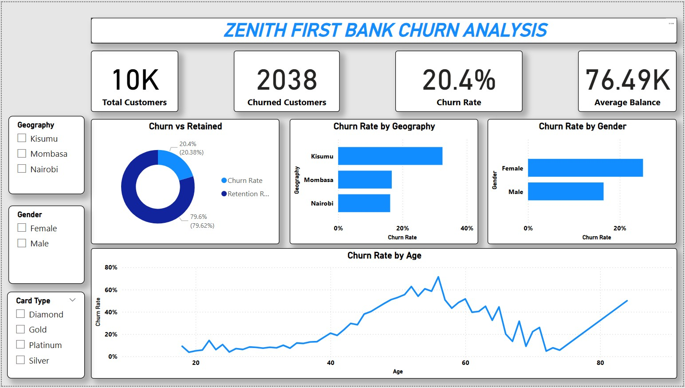

# customer-churn-analysis
Customer Churn Analysis Dashboard built with Power BI. Uncovering key trends, churn rates and customer behavior using interactive visuals and DAX measures

# 🧠 Customer Churn Analysis Dashboard with Power BI

**Project Type**: Data Analytics & Visualization  
**Tool Used**: Power BI

## 📊 Overview

This project explores customer churn using a dynamic Power BI dashboard. It provides key insights into churn behavior based on demographics, geography, satisfaction, and card type. The dashboard leverages DAX measures for calculated churn rates and helps organizations make data-driven retention decisions.

## 🚀 Key Features

- Churn Rate KPIs (Total Churned, Churn %, Retention Rate)
- Geographic Churn Breakdown (Kisumu, Mombasa, Nairobi)
- Gender-Based Churn Comparison
- Churn Rate by Age Visualization
- Customer Segmentation by Card Type (Diamond, Gold, Platinum, Silver)
- Interactive Filters for Geography, Gender, and Card Tier
- Built-in DAX Measures for Real-Time Analysis

## 🖼️ Dashboard Preview

## 📁 Files Included

- `customer_churn.pbix`: Power BI dashboard file
- `churn.jpg`: Preview image of the dashboard

